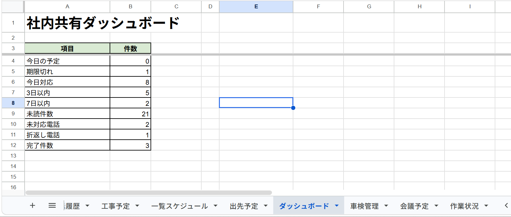
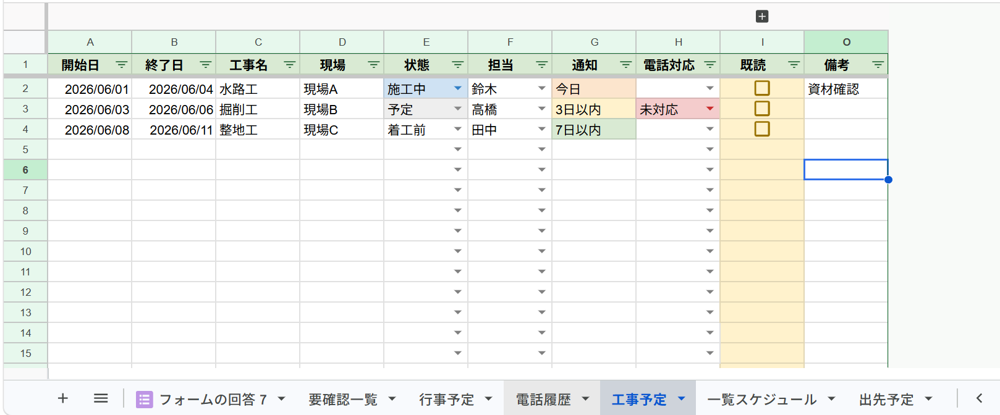
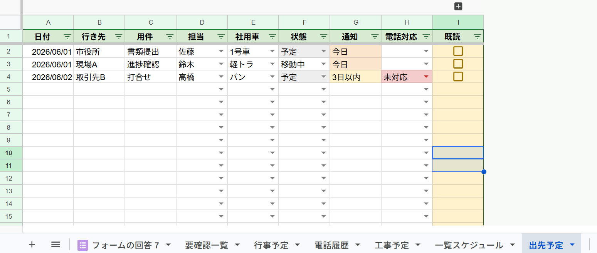
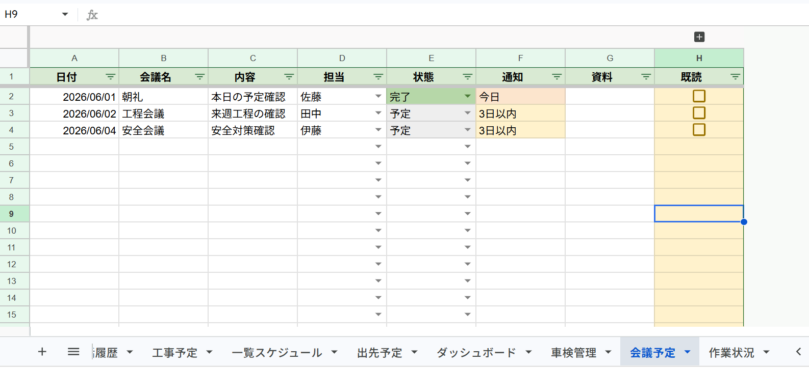
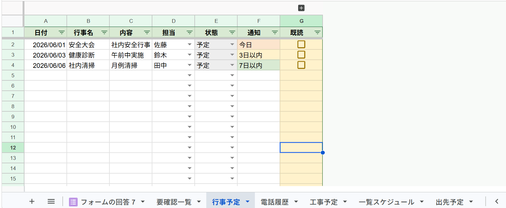
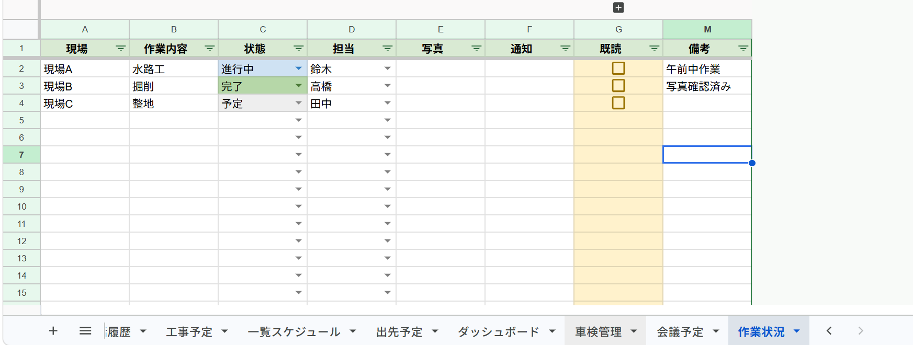
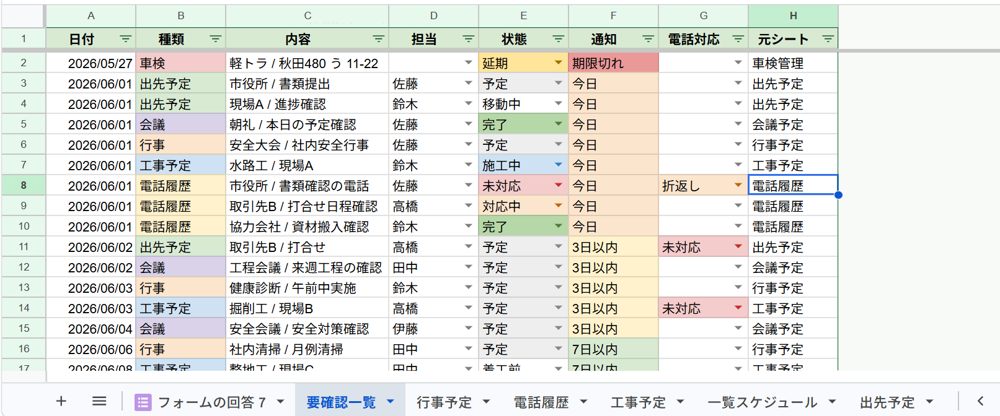
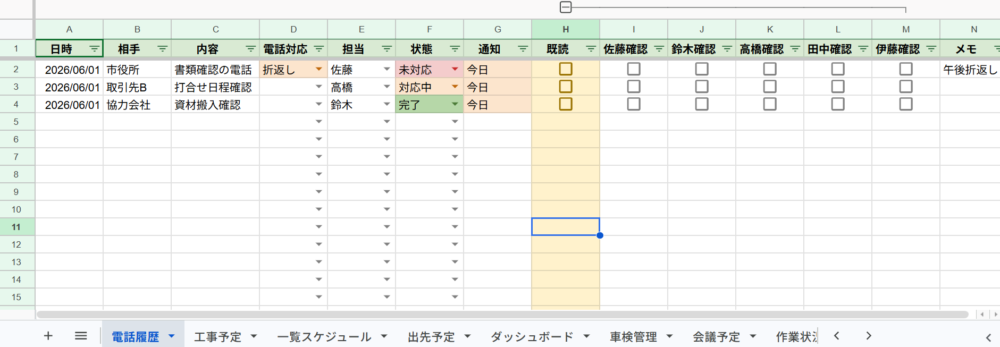

# 社内共有スケジュール管理システム

## 概要

Google Workspace を活用し、社内の予定・進捗・電話対応・車両管理を一元管理するための社内共有システムを構築しました。

Google Sheets をデータベースとして利用し、Google Apps Script（GAS）による自動集計・自動更新機能を実装しています。

複数の管理シートを一覧スケジュールへ自動集約し、要確認事項の抽出やダッシュボードによる状況把握を可能にしました。

---

## 開発背景

社内では、

* 電話対応履歴
* 出先予定
* 工事予定
* 会議予定
* 車検管理

などが口頭や紙で管理されており、

* 電話折返し忘れ
* 情報共有漏れ
* 車検期限の見落とし
* 予定把握の遅れ

が発生していました。

そこで Google Workspace を活用し、低コストで運用可能な社内共有システムを開発しました。

---

## 成果

本システムにより、

* 社内予定の一元管理
* 電話対応状況の共有
* 車検期限の可視化
* 個人確認状況の管理
* 要確認事項の自動抽出

を実現しました。

Google Apps Script による自動集計機能を実装し、入力内容を一覧スケジュールへ自動反映することで、情報共有の効率化を図りました。

---

## 主な機能

### 予定管理

* 工事予定
* 出先予定
* 会議予定
* 行事予定

### 業務管理

* 作業状況管理
* 電話履歴管理
* 車検管理

### 情報共有

* 一覧スケジュール自動集約
* 個人確認機能
* 既読管理
* 要確認一覧生成

### ダッシュボード

以下を自動集計

* 今日の予定
* 期限切れ
* 本日対応
* 3日以内予定
* 7日以内予定
* 未読件数
* 未対応電話
* 折返し電話
* 完了件数

---

## システム構成

Google Sheets

↓

出先予定

会議予定

行事予定

工事予定

作業状況

車検管理

電話履歴

↓

一覧スケジュール（自動生成）

↓

要確認一覧（自動生成）

↓

ダッシュボード（自動集計）

---

## 実装機能

### Google Apps Script

* 一覧スケジュール自動生成
* 要確認一覧自動生成
* ダッシュボード自動集計
* 個人確認列自動生成
* 期限警告判定
* 条件付き書式による色分け
* 既読管理
* フィルター自動設定
* 日付列自動判定
* カレンダー入力対応
* 一覧スケジュール自動更新
* 要確認一覧自動更新

### 入力支援

* プルダウン入力
* カレンダー入力
* チェックボックス入力
* 状態管理
* 電話対応管理

---

## 工夫した点

### 情報の一元管理

各シートの情報を一覧スケジュールへ集約し、社内全体の予定を確認できるようにしました。

### 要確認一覧

期限切れや近日中の予定を自動抽出し、確認漏れを防止できるようにしました。

### 状態の視覚化

条件付き書式を利用し、

* 完了
* 進行中
* 施工中
* 延期
* 未対応

などを色分け表示しています。

### 個人確認機能

15名まで対応可能な個人確認チェックボックスを実装し、誰が確認済みか把握できるようにしました。

### カレンダー入力

日付・日時・開始日・終了日・車検日・保険期限をヘッダー名で自動判定し、列位置に依存せずカレンダー入力できるようにしました。

### 自動更新

予定登録時に一覧スケジュールおよび要確認一覧を自動更新することで、情報反映の手間を削減しました。

---

## 使用技術

* Google Sheets
* Google Apps Script (GAS)
* JavaScript
* Git
* GitHub
* Google Workspace

---

## 更新履歴

### v4.0

* 日付列自動認識
* カレンダー入力対応
* 個人確認機能改善
* 一覧スケジュール改善
* 要確認一覧改善
* ダッシュボード改善
* 15名個人確認対応
* 一覧スケジュール自動更新
* 要確認一覧自動更新

---

## スクリーンショット

### ダッシュボード



### 一覧スケジュール


### 工事予定



### 出先予定



### 会議予定



### 行事予定



### 作業状況



### 車検管理


### 電話履歴


### 要確認一覧



### 個人確認機能



---

## フォルダ構成

```text
company_schedule_portfolio
├─ screenshots
│  ├─ ダッシュボード.png
│  ├─ 一覧スケジュール.png
│  ├─ 工事予定.png
│  ├─ 出先予定.png
│  ├─ 会議予定.png
│  ├─ 行事予定.png
│  ├─ 作業状況.png
│  ├─ 車検管理.png
│  ├─ 電話履歴.png
│  ├─ 要確認一覧.png
│  └─ 既読展開.png
│
├─ apps_script.js
└─ README.md
```

---

## 学習内容

Google Workspace 環境を利用し、

* Google Sheets
* Google Apps Script
* Git / GitHub

を独学で学習しました。

実際の業務を想定し、

* 情報共有
* 進捗管理
* 期限管理
* 業務改善

を目的としたシステム設計・実装を行いました。

今後は AppSheet との連携強化や通知機能の拡張を行い、スマートフォンからも利用しやすい業務管理システムへの発展を予定しています。


