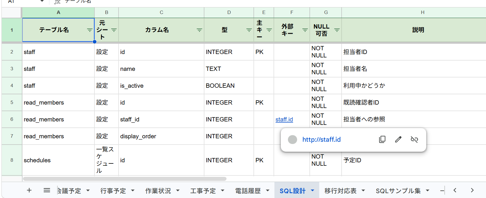
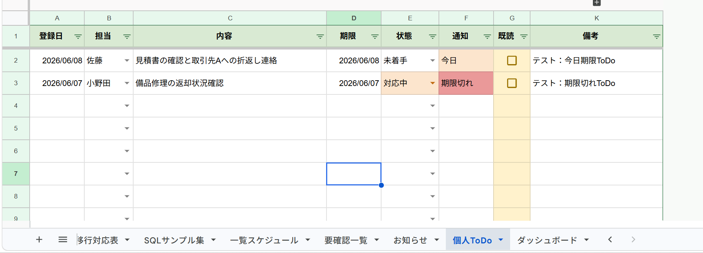
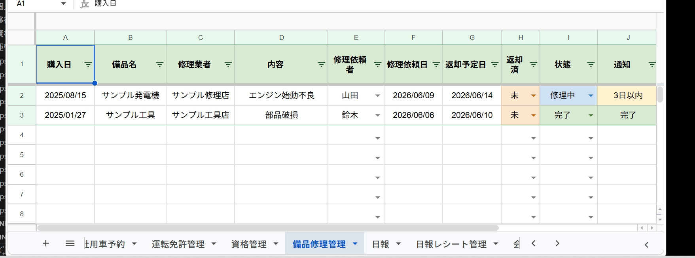
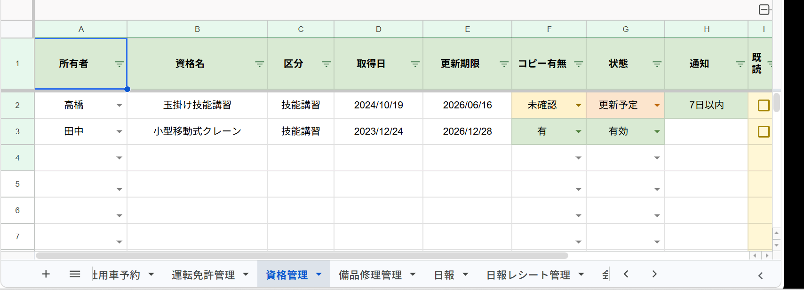
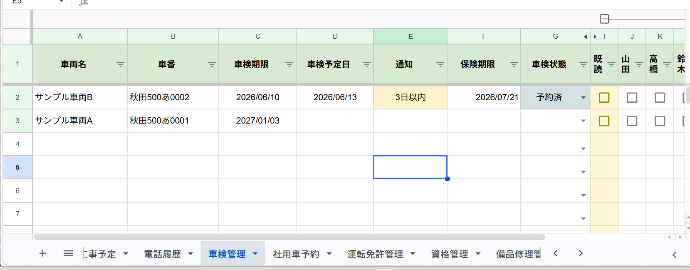
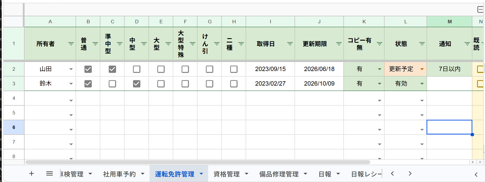

# 社内共有業務管理システム

Google Sheets / Google Apps Script / AppSheet を活用した、社内向けの業務管理・情報共有システムです。

予定管理、電話履歴、車検管理、車検履歴、日報、備品修理、運転免許、資格管理、個人ToDo、お知らせ、PDF帳簿、SQL移行設計までを Google Workspace 上で一元管理できるようにしています。

現在の安定版は以下です。

```text
v9.7.14-schedule-construction-notice-fixed
```

---

## 概要

このシステムは、社内で分散していた予定・電話対応・車両管理・日報・備品修理・免許資格情報を、Google Sheets 上でまとめて管理するための業務改善システムです。

入力用シートに登録した情報を、Apps Script によって `一覧スケジュール` と `要確認一覧` に自動集約します。

また、AppSheet と連携することで、スマートフォンやタブレットからの入力にも対応できる構成にしています。

---

## 開発背景

社内では、以下のような情報が紙・口頭・個別ファイルで管理されやすく、確認漏れや共有漏れが発生しやすい状態でした。

* 出先予定
* 工事予定
* 会議予定
* 行事予定
* 電話対応履歴
* 車検期限
* 社用車予約
* 日報
* 備品修理
* 運転免許
* 資格更新
* 個人ToDo
* お知らせ

そこで、Google Sheets を社内業務データベースとして利用し、Apps Script による自動集約・自動通知・既読管理・PDF出力・AppSheet連携を実装しました。

---

## 主な機能

### 一覧スケジュール自動生成

各入力シートの予定・対応履歴・期限情報を `一覧スケジュール` に自動集約します。

対象例：

* 出先予定
* 工事予定
* 会議予定
* 行事予定
* 電話履歴
* 車検管理
* 社用車予約
* 日報
* 運転免許管理
* 資格管理
* 備品修理管理
* 個人ToDo

---

### 要確認一覧の自動抽出

期限が近いもの、当日対応が必要なもの、重要なお知らせ、未対応の電話などを `要確認一覧` に自動抽出します。

通知例：

* 期限切れ
* 今日
* 3日以内
* 7日以内
* 30日以内
* 重要
* 未確認
* 差戻し
* 未精算

完了済みの行は、原則として要確認一覧に残らないようにしています。

---

### 既読・個人確認管理

各入力シートに `既読` 列と個人確認列を用意しています。

入力済み行だけにチェックボックスを表示し、空行には不要なチェックボックスが残らないようにしています。

個人確認列は、設定シートの `既読確認者` から管理します。

---

### 担当者・社用車の設定シート管理

担当者や社用車は、コード固定ではなく `設定` シートから読み込む構成です。

担当者や社用車を変更した場合は、以下のメニューで入力シートへ反映します。

```text
社内管理
→ 保守用：初回・構成修復
→ 入力シートだけ設定反映
```

これにより、コードを直接編集せずに担当者や社用車のプルダウンを更新できます。

---

### 工事予定管理

工事予定では、以下の情報を管理します。

* 工事名
* 現場
* 依頼主
* 連絡先
* 契約金額
* 開始日
* 終了日
* 状態
* 担当
* 通知
* 電話対応
* 既読
* 個人確認
* 備考

状態には、以下のような値を使用します。

```text
予定
未契約
着工前
施工中
完了
延期
中止
```

工事予定は専用の通知判定を使っています。

開始日を過ぎた工事予定が、一覧スケジュール側だけ `期限切れ` に戻らないよう、工事予定シート本体と一覧スケジュールで同じ通知判定を使うようにしています。

---

### 電話履歴管理

電話履歴では、相手・内容・担当・電話対応・対応メモなどを管理します。

電話対応の状態例：

```text
未対応
対応中
折返し
完了
```

未対応や折返しの電話は、要確認一覧に出るようにしています。

---

### 車検管理

車両ごとの車検期限、車検予定日、保険期限、車検状態、写真、備考を管理します。

車番列は、日付化を防ぐために文字列形式で扱います。

---

### 車検履歴管理

車検更新時には、旧車検期限と新車検期限を `車検履歴` に記録します。

基本運用は以下です。

```text
1. 車検管理で「車検予定日」に新しい車検期限を入力
2. 車検状態を「更新済」にする
3. 車検履歴へ旧期限・新期限を記録
4. 車検期限を新しい期限へ更新
5. 車検予定日を空欄に戻す
6. 車検状態を空欄に戻す
```

自動で動かない場合は、保守メニューから手動処理もできます。

```text
社内管理
→ 保守用：個別修復
→ 選択行を車検予定日で履歴追加＋期限更新
```

---

### 社用車予約

社用車、利用者、行き先、用途、開始時刻、終了時刻などを管理します。

社用車の候補は、設定シートの `社用車` から読み込みます。

---

### 日報管理

日報シートでは、日付、担当、現場、作業内容、進捗、問題点、明日の予定、写真、日報文章、PDFリンクを管理します。

日報PDFの作成にも対応しています。

```text
社内管理
→ 選択行の日報PDFを作成
```

---

### 日報レシート管理

日報に関連するレシート・立替・経理確認・精算状態を管理します。

経理確認や精算状態に応じて、要確認一覧に反映できます。

---

### 運転免許管理

担当者ごとの運転免許情報を管理します。

管理項目例：

* 所有者
* 更新期限
* 免許種別
* コピー有無
* 状態
* 通知
* 備考

更新期限が近いものは、一覧スケジュールや要確認一覧に反映されます。

---

### 資格管理

資格名、所有者、区分、取得日、更新期限、コピー有無、状態を管理します。

資格の更新期限が近い場合、要確認一覧に表示されます。

---

### 備品修理管理

備品の故障・修理依頼・返却予定・返却済み状態を管理します。

管理項目例：

* 備品名
* 内容
* 修理依頼者
* 修理依頼日
* 返却予定日
* 返却済
* 状態
* 通知
* 備考

---

### お知らせ管理

重要なお知らせや社内共有事項を管理します。

重要度が高く、未読のものは要確認一覧に反映されます。

---

### 個人ToDo管理

担当者ごとの個人タスクを管理します。

期限・状態に応じて、一覧スケジュールや要確認一覧に反映できます。

---

### フィードバック管理

利用者からの改善要望・入力しづらい点・表示不備・動作不備などを記録するシートです。

ベータ運用時の改善履歴としても利用できます。

---

### PDF帳簿出力

一覧や日報などをPDF帳簿として出力するための機能を用意しています。

PDF出力履歴は `帳簿PDF履歴` に記録します。

---

### SQL移行設計

Google Sheetsで運用しているシート構成を、将来的にRDBへ移行できるように、SQL設計・移行対応表・SQLサンプル集を用意しています。

含まれるシート例：

* SQL設計
* 移行対応表
* SQLサンプル集

---

## シート構成

### 入力・運用シート

* 出先予定
* 工事予定
* 会議予定
* 行事予定
* 作業状況
* 電話履歴
* 車検管理
* 車検履歴
* 社用車予約
* 日報
* 日報レシート管理
* 運転免許管理
* 資格管理
* 備品修理管理
* お知らせ
* 個人ToDo
* フィードバック

### 自動集約・集計シート

* 一覧スケジュール
* 要確認一覧
* 過去一覧
* 担当別未読
* 既読率集計
* ダッシュボード

### 帳簿・設定・説明シート

* 帳簿PDF履歴
* 帳簿出力設定
* 設定
* 手順シート
* 社内管理説明
* GPT診断用
* 機能チェック

### SQL関連シート

* SQL設計
* 移行対応表
* SQLサンプル集

---

## メニュー構成

このシステムでは、スプレッドシート上に `社内管理` メニューを追加します。

### 通常運用メニュー

普段使う操作を上部に配置しています。

```text
社内管理
→ バージョン確認
→ 日常更新（一覧＋要確認）
→ 集計更新（未読・既読率・DB）
→ GPT診断用シートを作成
→ 機能チェックシートを作成
→ データ整合性チェック・軽微修正
→ 選択行の日報PDFを作成
→ 一覧帳簿PDFを作成
```

### 初回・構成修復

設定変更や構成修復時に使います。

```text
社内管理
→ 保守用：初回・構成修復
→ 入力シートだけ設定反映
→ 裏方シートを作成/修復
→ 手順シートを作成/更新
→ ベータ確認準備（軽量）
→ 新規ベータ作成（危険・既存データ注意）
```

### 個別修復

特定シートだけを修復するときに使います。

```text
社内管理
→ 保守用：個別修復
→ 行事予定に終了日列を追加/修復
→ 車検更新済を処理（履歴＋期限更新）
→ 設定シートに社用車一覧を追加/修復
→ 工事予定の未契約・通知完了・色を修復
→ 選択行を車検予定日で履歴追加＋期限更新
→ 選択行の車検履歴を手動追加
→ 運転免許シートのズレ調整
→ 免許・資格・備品だけコンパクト表示
```

### 表示調整

表示幅やカラーリングを整えるためのメニューです。

```text
社内管理
→ 保守用：表示調整
→ 全入力シートを標準表示に整える（少し大きめ）
→ 今のシートだけコンパクト表示
→ 今のシートだけ標準表示に戻す
→ 今のシートの非表示列をすべて表示
→ 今のシートだけ表示調整
```

### 重い処理・通常使用禁止

通常運用では頻繁に使わない処理です。

```text
社内管理
→ 保守用：重い処理・通常使用禁止
→ 全体更新（保守用・重め）
→ 書式込み全体更新（かなり重い）
→ 旧列名をv9.7.0へ移行
→ 車検管理を修復（車番文字列＋色）
→ 過去予定を過去一覧へ移動
→ 月次整理（過去移動＋月別）
```

---

## 運用方法

### 通常の更新

普段は以下だけで運用できます。

```text
社内管理
→ 日常更新（一覧＋要確認）
```

一覧スケジュールと要確認一覧が更新されます。

---

### 担当者を変更した場合

`設定` シートの `担当者` を変更した後、以下を実行します。

```text
社内管理
→ 保守用：初回・構成修復
→ 入力シートだけ設定反映
```

続けて、一覧も更新します。

```text
社内管理
→ 日常更新（一覧＋要確認）
```

---

### 社用車を変更した場合

`設定` シートの `社用車` を変更した後、以下を実行します。

```text
社内管理
→ 保守用：初回・構成修復
→ 入力シートだけ設定反映
```

---

### 表示を整える場合

全体を読みやすくする場合：

```text
社内管理
→ 保守用：表示調整
→ 全入力シートを標準表示に整える（少し大きめ）
```

横スクロールを減らしたい場合：

```text
社内管理
→ 保守用：表示調整
→ 今のシートだけコンパクト表示
```

---

### ベータ確認時

ベータ確認前は以下を実行します。

```text
社内管理
→ 日常更新（一覧＋要確認）
```

必要に応じて以下も実行します。

```text
社内管理
→ GPT診断用シートを作成
社内管理
→ 機能チェックシートを作成
```

---

## AppSheet連携

このシステムは AppSheet と連携し、スマートフォンやタブレットからの入力にも対応できます。

AppSheet側では、各シートごとに以下を確認します。

* Key列
* Label列
* Date型
* Time型
* Yes/No型
* Image型
* URL型
* Enum型
* 表示順
* 入力フォーム
* Detail / Table / Deck View

主なKey候補：

| シート      | Key候補     |
| -------- | --------- |
| 出先予定     | 出先ID      |
| 工事予定     | 工事ID      |
| 電話履歴     | 電話ID      |
| 車検管理     | 車両ID      |
| 運転免許管理   | 免許ID      |
| 資格管理     | 資格ID      |
| 備品修理管理   | 修理ID      |
| 日報       | 日報ID      |
| 日報レシート管理 | レシートID    |
| フィードバック  | フィードバックID |

列やプルダウンを変更した場合は、AppSheet側で `Regenerate Structure` を実行します。

---

## スクリーンショット

### ダッシュボード

システム全体の件数、要確認件数、未読状況を確認できます。


---

### 一覧スケジュール

出先予定、工事予定、電話履歴、車検、社用車予約、免許資格、備品修理などを一覧に集約します。


---

### 要確認一覧

期限が近い予定、未対応の電話、重要なお知らせなど、確認が必要な情報だけを抽出します。


---

### SQL設計

Google Sheetsで運用しているデータを、将来的にRDBへ移行できるようにテーブル設計を整理しています。



---

### 個人ToDo

担当者ごとの個人タスクを管理し、期限や状態に応じて一覧・要確認へ反映します。



---

### 備品修理管理

備品の故障、修理依頼、返却予定、返却済み状態を管理します。



---

### 移行対応表

Google Sheetsの各シートと、SQLテーブル移行時の対応関係を整理しています。


---

### 資格管理

資格名、所有者、更新期限、コピー有無などを管理し、期限が近いものを要確認に出します。



---

### 車検管理

車両ごとの車検期限、車検予定日、車検状態、通知を管理します。



---

### 運転免許管理

担当者ごとの免許種別、更新期限、コピー有無、状態を管理します。



---

## 技術構成

* Google Sheets
* Google Apps Script
* AppSheet
* Google Drive
* Google Calendar
* PDF出力
* SQL設計

---

## 実装上の工夫

### 設定シート管理

担当者、既読確認者、社用車などを設定シートで管理し、コードを直接編集しなくても運用設定を変更できるようにしています。

---

### 入力済み行だけチェックボックス表示

空行に既読チェックボックスが大量に残ると、見づらくなるだけでなく getLastRow が伸びて重くなる原因になります。

そのため、入力済み行だけに既読・個人確認チェックボックスを表示するようにしています。

---

### ID列によるAppSheet対応

AppSheetで `_RowNumber` をKeyにしないよう、各入力シートにID列を用意しています。

例：

* 工事ID
* 車両ID
* 電話ID
* 免許ID
* 資格ID
* 修理ID
* 日報ID

---

### 車番の日付化防止

車番列は文字列形式に固定し、Google Sheets上で日付として誤変換されないようにしています。

---

### 保守メニューの隔離

普段使うメニューと、重い処理・危険な処理を分けています。

これにより、通常運用中に誤って全体更新や新規ベータ作成を実行しにくい構成にしています。

---

### 工事予定の通知判定統一

工事予定は、シート本体と一覧スケジュールで通知判定がズレないように、専用の通知判定関数を使っています。

これにより、一覧スケジュール側だけ `期限切れ` に戻る問題を防いでいます。

---

## SQL移行設計

Google Sheets版で運用しつつ、将来的にRDBへ移行できるように、SQL設計シートを用意しています。

設計対象例：

* users
* schedules
* construction_projects
* phone_logs
* vehicles
* vehicle_inspection_histories
* daily_reports
* equipment_repairs
* licenses
* qualifications
* todos
* notices

---

## ポートフォリオとしてのポイント

このシステムは、単なるサンプルアプリではなく、実際の社内業務を想定した業務改善システムとして作成しています。

特徴：

* 実務に近いシート構成
* 複数業務を横断した一覧化
* 期限通知・要確認抽出
* 既読管理
* 車検履歴管理
* PDF出力
* AppSheet連携
* SQL移行設計
* 設定シート管理
* フィードバックを反映した継続改善

---

## 注意事項

このリポジトリに掲載しているデータは、ポートフォリオ用のサンプルデータです。

実際の会社名、担当者名、地名、車両名、電話番号、金額、取引先名などは含めない方針です。

社内運用版とは別に、GitHub公開用として匿名化・サンプル化しています。

---

## 今後の改善予定

* AppSheet画面のシート別調整
* 操作デモ動画の追加
* READMEへの処理フロー図追加
* PDF帳簿レイアウト改善
* SQLファイルの追加整理
* フィードバック内容の反映
* AppSheet側の型・ビュー設定の整理

---

## 更新履歴

### v9.7.14-schedule-construction-notice-fixed

* 工事予定の状態に `未契約` を追加
* 工事予定の通知判定をシート本体と一覧スケジュールで統一
* 通知 `完了` のカラーリングを追加
* 未契約と延期の色被りを調整
* 社用車プルダウンを設定シート管理に対応
* 車検履歴の更新済処理を安定化
* 入力済み行だけチェックボックスを出す処理を安定化
* 表示調整メニューを整理
* GPT診断用・機能チェック用の確認項目を強化

---

## ライセンス

ポートフォリオ用途で公開しています。
実運用データ・社内固有情報は含めていません。


