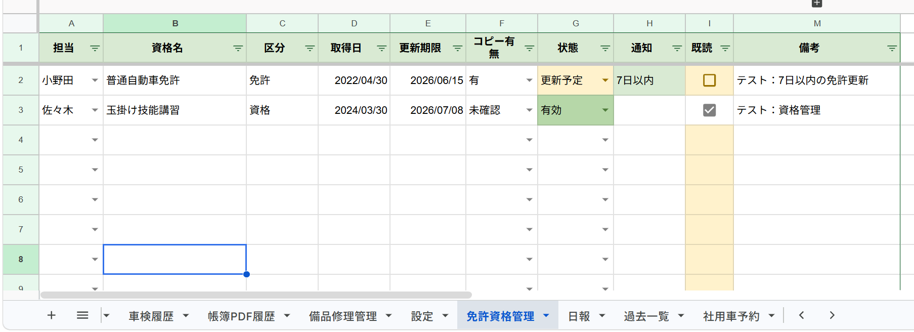

# 社内共有業務管理システム

## 概要

Google Workspace（Google Sheets / Google Apps Script / Google Calendar）と AppSheet を活用し、社内の予定・電話履歴・車検・日報・備品修理・免許資格などを一元管理する業務改善システムです。

各入力シートに登録された情報を「一覧スケジュール」へ自動集約し、期限切れ・未対応・未返却・更新期限などの要確認事項を「要確認一覧」へ抽出します。

また、担当者ごとの既読管理、担当別未読集計、既読率集計、ダッシュボード、Googleカレンダー連携、PDF帳簿出力、AppSheetによるスマートフォン・タブレット入力にも対応しています。

さらに、将来的なRDB移行を想定し、SQL設計シート・移行対応表・SQLサンプル集も作成しています。

---

## 開発背景

社内では、以下の情報がそれぞれ個別に管理されていました。

* 出先予定
* 工事予定
* 会議予定
* 行事予定
* 電話履歴
* 車検期限
* 保険期限
* 社用車予約
* 日報
* 備品修理
* 免許資格
* 個人ToDo
* お知らせ

その結果、以下のような課題がありました。

* 情報共有漏れが発生しやすい
* 電話の折返し忘れが起きやすい
* 車検期限や保険期限の見落としが発生しやすい
* 備品の修理・返却状況が分かりにくい
* 免許資格の更新期限を確認しにくい
* 誰が確認済みか分かりにくい
* 予定や日報を外出先・現場から入力しにくい
* 日報や一覧帳簿のPDF作成に手間がかかる

これらを解決するため、Google Sheetsを簡易データベースとして利用し、Apps Scriptによる自動集約・通知・PDF出力、AppSheetによる現場入力を組み合わせた社内共有業務管理システムを作成しました。

---

## 主な機能

### 予定・スケジュール管理

* 出先予定管理
* 工事予定管理
* 会議予定管理
* 行事予定管理
* 社用車予約管理
* Googleカレンダー連携
* 月別グループ化
* 過去一覧へのアーカイブ

### 業務記録管理

* 作業状況管理
* 電話履歴管理
* 日報管理
* 日報文章作成
* 日報PDF出力
* 一覧帳簿PDF出力

### 車両・備品・資格管理

* 車検管理
* 車検履歴管理
* 車検期限管理
* 保険期限管理
* 次回車検期限管理
* 次回保険期限管理
* 備品修理管理
* 返却予定管理
* 返却済管理
* 免許資格管理
* コピー有無管理
* 更新期限管理

### 情報共有・確認管理

* 一覧スケジュール自動生成
* 要確認一覧自動生成
* 個人既読管理
* 担当別未読集計
* 既読率集計
* お知らせ管理
* 個人ToDo管理
* ダッシュボード自動集計

### AppSheet連携

* スマートフォン・タブレットからの入力
* 現場・外出先からの確認
* 主要シートのモバイル表示
* 日報・予定・車検・備品修理などの入力補助

### SQL移行設計

* SQL設計シート
* 移行対応表
* SQLサンプル集
* 既読管理の縦持ち化設計
* 車検管理と車検履歴の親子関係整理
* Google Sheets版からRDB版への移行方針整理

---

## シート構成

主なシートは以下です。

* ダッシュボード
* 一覧スケジュール
* 要確認一覧
* 出先予定
* 工事予定
* 会議予定
* 行事予定
* 作業状況
* 電話履歴
* 車検管理
* 車検履歴
* 社用車予約
* 日報
* 免許資格管理
* 備品修理管理
* お知らせ
* 個人ToDo
* 担当別未読
* 既読率集計
* 過去一覧
* 帳簿PDF履歴
* 設定
* SQL設計
* 移行対応表
* SQLサンプル集

---

## システム構成

```text
Google Sheets
│
├─ 出先予定
├─ 工事予定
├─ 会議予定
├─ 行事予定
├─ 作業状況
├─ 電話履歴
├─ 車検管理
├─ 車検履歴
├─ 社用車予約
├─ 日報
├─ 免許資格管理
├─ 備品修理管理
├─ お知らせ
└─ 個人ToDo

        ↓ Apps Scriptで自動集約

一覧スケジュール

        ↓ 条件判定

要確認一覧

        ↓ 集計

担当別未読
既読率集計
ダッシュボード

        ↓ 連携

Google Calendar
Google Drive
PDF出力
AppSheet

        ↓ 将来設計

SQL設計
移行対応表
SQLサンプル集
```

---

## 使用技術

### Google Workspace

* Google Sheets
* Google Apps Script
* Google Calendar
* Google Drive

### モバイル対応

* AppSheet

### 開発言語

* JavaScript

### 管理・公開

* Git
* GitHub

### 設計

* SQL設計
* RDB移行設計
* データ構造整理
* 業務フロー整理

---

## 工夫した点

### 複数シートの情報を一覧化

出先予定、工事予定、会議予定、行事予定、電話履歴、車検管理、日報、備品修理、免許資格など、複数シートに分かれた情報を「一覧スケジュール」へ自動集約するようにしました。

これにより、各シートを個別に確認しなくても、全体の予定・対応状況を把握できます。

---

### 要確認事項の自動抽出

期限切れ、今日、3日以内、7日以内の予定や期限を自動判定し、「要確認一覧」に集約します。

また、以下のような業務上の未対応項目も確認対象として扱います。

* 未対応電話
* 折返し電話
* 未返却備品
* 更新期限が近い免許資格
* 車検期限・保険期限が近い車両
* 高重要度のお知らせ
* 未完了ToDo

---

### 個人既読管理

全体の「既読」だけでなく、担当者ごとの個人確認列を用意し、誰が確認済みかを可視化できるようにしました。

個人確認列は折りたたみグループ化し、普段の表示を圧迫しないようにしています。

---

### 自動出力シートの入力規則エラー対策

一覧スケジュールや要確認一覧などの自動出力シートには、状態・担当・電話対応などの入力規則を付けない設計にしています。

これにより、元シートごとに異なる状態値が集約されても、`setValues()` 実行時に入力規則違反で処理が止まらないようにしました。

---

### 車検管理と車検履歴の分離

車検管理では、現在有効な期限を管理します。

* 車検期限
* 次回車検期限
* 保険期限
* 次回保険期限

車検更新完了処理を実行すると、次回期限を現在期限へ反映し、旧期限・新期限を車検履歴へ記録します。

これにより、現在の管理情報と過去の更新履歴を分けて管理できます。

---

### 日報PDF・一覧帳簿PDF出力

日報シートに入力された内容から、日報文章を作成し、PDFとして保存できるようにしました。

また、一覧帳簿PDFを作成することで、他部門共有や紙出力にも対応しやすくしています。

---

### AppSheetによる現場入力対応

AppSheetと連携することで、スマートフォンやタブレットから予定・日報・車検・備品修理などを入力できるようにしました。

PCだけでなく、現場・外出先からの入力や確認を想定しています。

---

### SQL移行を想定した設計

現在はGoogle Sheetsを簡易データベースとして利用していますが、将来的なRDB移行も想定し、SQL設計シート・移行対応表・SQLサンプル集を作成しました。

特に、Google Sheetsでは横持ちになりやすい個人既読列を、SQL設計では `read_checks` テーブルとして縦持ち化する方針にしています。

---

## SQL設計の意図

Google Sheets版では、現場や事務担当者が入力しやすいように、シートごとに業務単位で列を持つ構成にしています。

一方で、SQL版では保守性・拡張性を考慮し、以下のような整理を行っています。

### 既読管理の縦持ち化

Google Sheets版では、個人確認列を横持ちで管理しています。

```text
既読 | 山田 | 高橋 | 鈴木
TRUE | TRUE | FALSE | TRUE
```

SQL版では、確認者が増えるたびに列を追加する構造は保守しにくいため、`read_checks` テーブルとして縦持ち化します。

```text
target_type | target_id | member_name | is_read
schedule    | 1         | 山田        | true
schedule    | 1         | 高橋        | false
schedule    | 1         | 鈴木        | true
```

### 車検管理と車検履歴の親子関係

車検管理は現在有効な期限を持つ管理テーブル、車検履歴は更新前後の期限を残す履歴テーブルとして整理しています。

これにより、現在の管理情報と過去の更新履歴を分けて扱えるようにしています。

### 移行対応表

Google Sheetsの各シート・各列が、SQL上のどのテーブル・カラムに対応するかを移行対応表として整理しています。

これにより、将来的にSQLiteやPostgreSQLなどへ移行する際の設計資料として利用できます。

---

## 導入前後の改善

### 導入前

* 予定、電話履歴、車検期限、備品修理、免許資格が別々に管理されていた
* 未対応電話や折返し対応の確認漏れが起きやすかった
* 車検期限や保険期限の更新履歴が残しにくかった
* 備品の修理状況や返却状況が分かりにくかった
* 免許資格の更新期限を確認しにくかった
* 日報や帳簿のPDF作成に手間がかかっていた
* 誰が確認済みか分かりにくかった
* 現場や外出先から入力しづらかった

### 導入後

* 各シートの情報を一覧スケジュールへ自動集約
* 未対応電話、期限切れ、未返却備品、更新期限の近い免許資格を要確認一覧へ自動抽出
* 既読管理により、確認状況を可視化
* 担当別未読と既読率を自動集計
* 車検更新処理により、旧期限・新期限を車検履歴へ記録
* 日報PDF・一覧帳簿PDFを作成可能
* AppSheetにより、スマートフォン・タブレットから入力可能
* SQL設計により、将来的なRDB移行も想定

### 改善効果

* 確認漏れの削減
* 情報を探す時間の短縮
* 紙や口頭での共有の削減
* 期限管理の見える化
* 現場入力と事務所確認の連携
* 将来的なシステム移行を見据えた設計

---

## 操作手順

### 初期設定

1. Google Sheetsを作成する
2. Apps Scriptにコードを貼り付ける
3. スプレッドシートを再読み込みする
4. メニュー「社内管理」を表示する
5. `社内管理 → 設定シートを作成/確認` を実行する
6. 設定シートに担当者・既読確認者を入力する
7. `社内管理 → 設定を各シートに反映` を実行する
8. `社内管理 → 全シート表示幅を強制調整` を実行する
9. `社内管理 → 個人確認グループを作り直す` を実行する

### 通常運用

1. 各入力シートに予定や記録を入力する
2. `社内管理 → 全体更新（軽量）` を実行する
3. 一覧スケジュールを確認する
4. 要確認一覧を確認する
5. 必要に応じてPDFを作成する
6. 必要に応じてGoogleカレンダーへ反映する

### 車検更新処理

1. 車検管理に次回車検期限と次回保険期限を入力する
2. 状態を「完了」または「更新済」にする
3. `社内管理 → 車検更新完了処理` を実行する
4. 車検期限・保険期限が更新されたことを確認する
5. 車検履歴に旧期限・新期限が記録されたことを確認する

### AppSheet利用時

1. AppSheetでGoogle Sheetsを読み込む
2. Data → Tables から対象テーブルを確認する
3. シート構成を変更した場合は Regenerate Structure を実行する
4. 不要な裏方シートやSQL設計シートはAppSheet側で非表示にする

---

## 機能チェック表

| No | チェック項目                | 結果 |
| -- | --------------------- | -- |
| 1  | 出先予定が一覧スケジュールに反映される   | OK |
| 2  | 工事予定が一覧スケジュールに反映される   | OK |
| 3  | 会議予定が一覧スケジュールに反映される   | OK |
| 4  | 行事予定が一覧スケジュールに反映される   | OK |
| 5  | 電話履歴の未対応が要確認一覧に残る     | OK |
| 6  | 車検期限切れが要確認一覧に出る       | OK |
| 7  | 備品修理の未返却が要確認一覧に出る     | OK |
| 8  | 免許資格の更新期限が要確認一覧に出る    | OK |
| 9  | 既読チェックが一覧スケジュールに反映される | OK |
| 10 | 担当別未読が更新される           | OK |
| 11 | 既読率集計が更新される           | OK |
| 12 | ダッシュボードが更新される         | OK |
| 13 | 車検更新完了処理で車検履歴に記録される   | OK |
| 14 | 日報PDFが作成される           | OK |
| 15 | 一覧帳簿PDFが作成される         | OK |
| 16 | Googleカレンダーへ予定を反映できる  | OK |
| 17 | AppSheetで主要シートを表示できる  | OK |
| 18 | SQL設計シートが作成される        | OK |
| 19 | 移行対応表が作成される           | OK |
| 20 | SQLサンプル集が作成される        | OK |

---

## スクリーンショット

### ダッシュボード


### 一覧スケジュール


### 要確認一覧


### 車検管理


### 備品修理管理


### 免許資格管理



### 個人ToDo


### SQL設計


### 移行対応表


## 今後の改善予定

* 権限管理の整理
* AppSheet画面の追加改善
* メール通知機能
* Slack / Teams 連携
* 承認ワークフロー
* KPIダッシュボード拡張
* SQLデータベースへの移行検証
* テストデータの拡充
* UIの簡素化
* 運用マニュアルの整備

---

## 注意事項

本リポジトリに含まれる担当者名・会社名・地名・車両情報はすべてポートフォリオ用の架空サンプルデータです。

実際の業務データ、個人情報、社内情報は含まれていません。

社用運用版とは異なり、GitHub公開用にサンプル名・サンプル地名・サンプル車両名へ置き換えています。

---

## ライセンス

Portfolio Project

