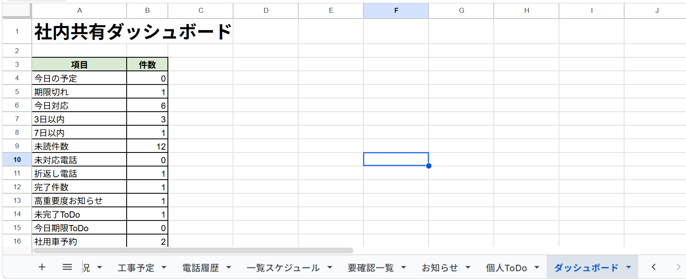
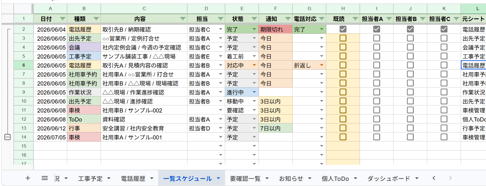
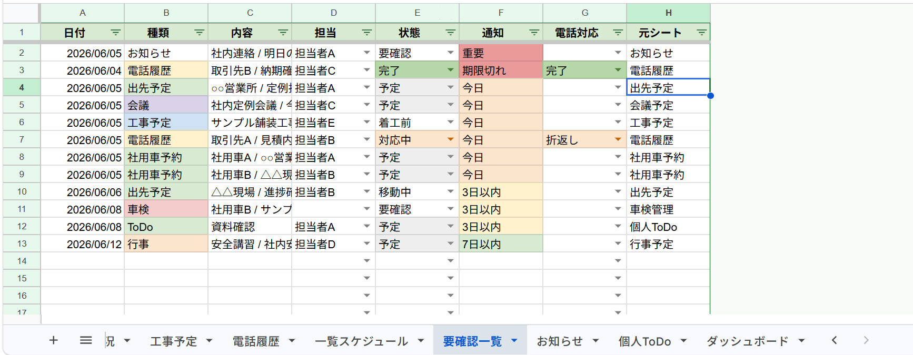
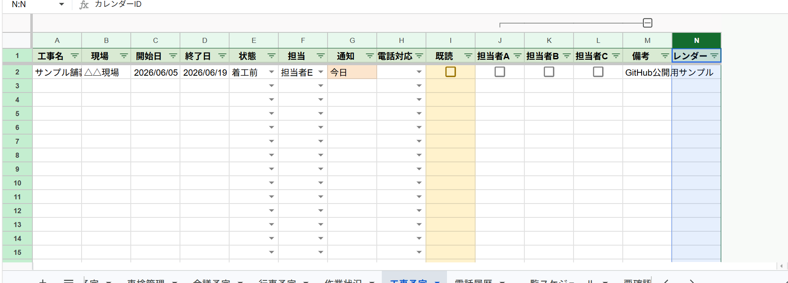
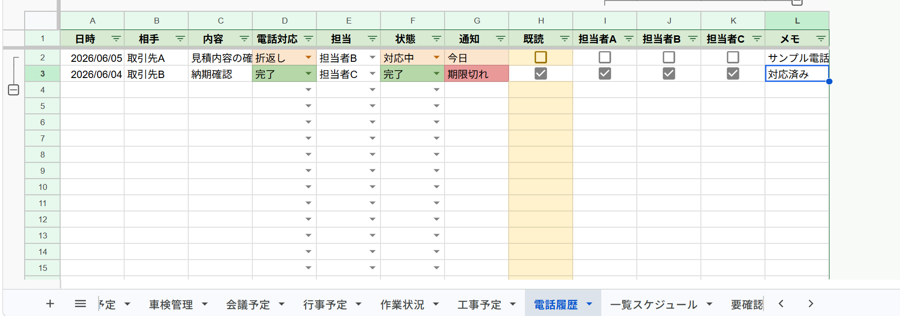
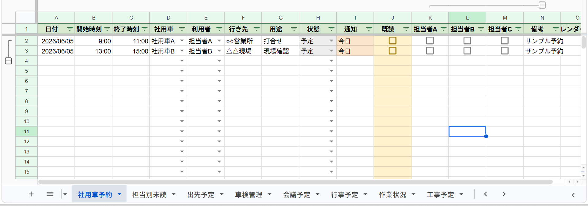
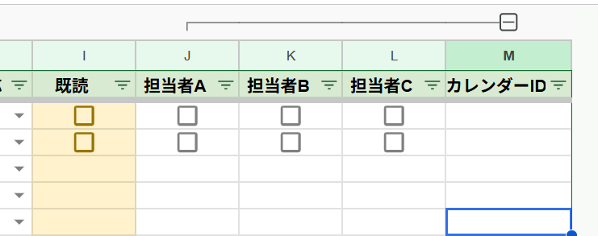
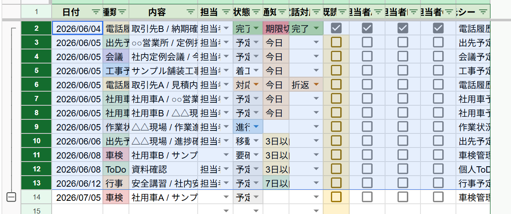
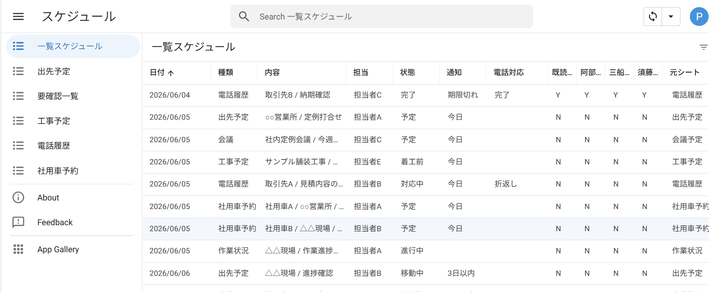

# 社内共有業務管理システム

## 概要

Google Workspace（Google Sheets / Google Apps Script / Google Calendar）を活用し、社内の予定・進捗・情報共有を一元管理する業務改善システムを開発しました。

複数の管理シートから一覧スケジュールを自動生成し、担当者ごとの既読管理、未読集計、要確認事項の抽出、Googleカレンダー連携を実現しています。

さらに AppSheet と連携することで、スマートフォンやタブレットからも利用できるようにし、現場・外出先からの入力にも対応しています。

---

## 開発背景

社内では以下の情報がそれぞれ個別管理されていました。

* 出先予定
* 工事予定
* 会議予定
* 電話履歴
* 車検管理
* 社用車予約
* 個人タスク

その結果、

* 情報共有漏れ
* 電話折返し忘れ
* 車検期限の見落とし
* 予定確認漏れ
* 社用車予約重複

などが発生していました。

これらを解決するため、Google Workspaceを利用した低コストな社内管理システムを構築しました。

---

## 主な機能

### 予定管理

* 出先予定管理
* 工事予定管理
* 会議予定管理
* 行事予定管理

### 業務管理

* 作業状況管理
* 電話履歴管理
* 車検管理
* 社用車予約管理
* 個人ToDo管理
* お知らせ管理

### 情報共有

* 一覧スケジュール自動生成
* 要確認一覧自動生成
* 個人既読管理
* 担当別未読集計
* 既読率集計
* 月別自動グループ化

### Googleカレンダー連携

* 予定自動登録
* 予定更新時の再同期
* イベントID管理
* 終日予定対応
* 時刻指定予定対応

### レポート機能

* PDF日報自動生成
* ダッシュボード自動集計

### 保守運用機能

* 自動バックアップ
* 定期更新トリガー
* 過去データ自動アーカイブ
* 過去一覧自動整理
* 全シート月別折りたたみ

### 社用車管理

* 社用車予約
* 予約重複自動検出
* 利用状況管理

---

## システム構成

```text
Google Sheets

↓

出先予定
工事予定
会議予定
行事予定
作業状況
車検管理
電話履歴
社用車予約
個人ToDo
お知らせ

↓

一覧スケジュール（自動生成）

↓

要確認一覧（自動生成）

↓

担当別未読集計

↓

既読率集計

↓

ダッシュボード

↓

Googleカレンダー

↓

AppSheet
```

---

## 使用技術

### Google Workspace

* Google Sheets
* Google Apps Script
* Google Calendar

### 開発言語

* JavaScript

### 開発環境

* Google Apps Script Editor
* Git
* GitHub

### モバイル対応

* AppSheet

---

## 工夫した点

### 情報の一元化

複数の管理シートを一覧スケジュールへ自動集約し、全体状況を把握しやすくしました。

### 個人既読管理

担当者ごとの確認状況を可視化し、情報共有漏れを防止しています。

### 要確認事項の抽出

期限切れ・今日・3日以内・7日以内の予定を自動抽出しています。

### 社用車予約管理

同一車両の予約重複を自動判定し、予約競合を防止しています。

### 過去データ整理

終了済みデータを自動で過去一覧へ移動し、月ごとに整理しています。

### 月別データ整理

全シートを月単位で自動グループ化し、長期間運用時でも視認性を維持できるようにしました。

### モバイル対応

AppSheet連携により、スマートフォンやタブレットからの入力・確認が可能です。

---

## 学習内容

本プロジェクトを通じて学習した内容

* Google Apps Scriptによる業務自動化
* Google Workspace活用
* データ集約処理
* スプレッドシート設計
* Googleカレンダー連携
* AppSheet連携
* Git / GitHub運用
* 業務改善システム開発

---

## スクリーンショット

### ダッシュボード



### 一覧スケジュール



### 要確認一覧



### 出先予定


### 工事予定



### 電話履歴



### 社用車予約



### 個人既読管理



### 月別管理



### AppSheet




---

## 今後の改善予定

* Slack連携
* Teams連携
* メール通知機能
* 承認ワークフロー
* 権限管理強化
* KPIダッシュボード拡張
* 日報管理機能
* 報告書管理機能

---

## 注意事項

本リポジトリに含まれる担当者名・会社名・地名・車両情報はすべてサンプルデータです。

実際の業務データは含まれていません。

---

## ライセンス

Portfolio Project


